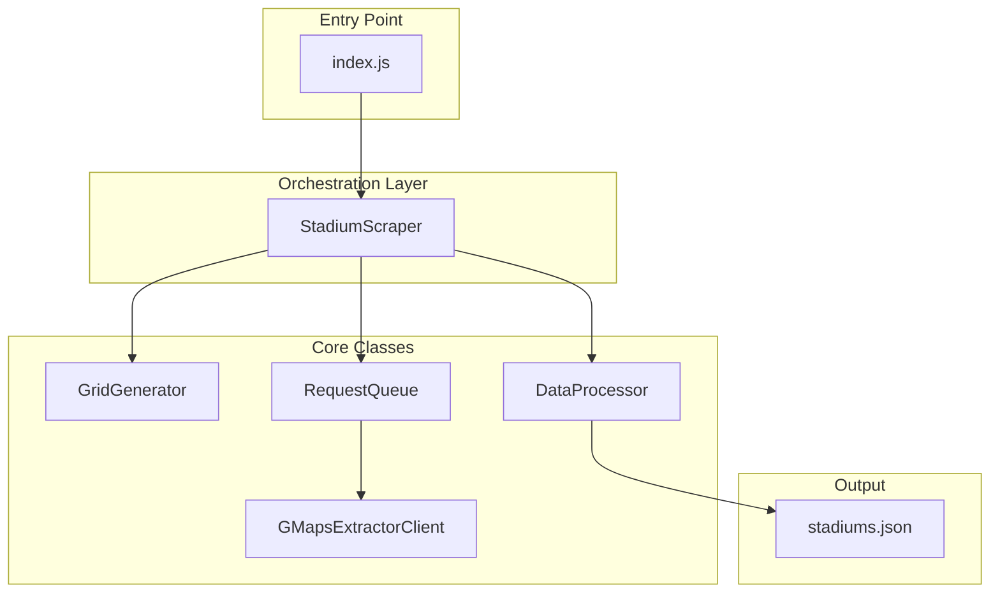

# Kế hoạch chi tiết: Quét sân bóng Việt Nam trên Google Maps (GMapsExtractor API)

## 1. Tổng quan kiến trúc



## 2. API và chiến lược tìm kiếm

**GMapsExtractor API v2 - Search**

- Endpoint: `POST https://cloud.gmapsextractor.com/api/v2/search`
- Authorization: `Bearer {{ token }}` (header)
- Content-Type: `application/json`
- Request body:
  - `q`: Query tìm kiếm (vd: "sân bóng đá")
  - `page`: Trang kết quả (1-10, mỗi trang tối đa 20 kết quả)
  - `ll`: Tọa độ format `@latitude,longitude,zoom` (vd: `@21.0285,105.8542,11z`)
  - `hl`: Ngôn ngữ (vd: `vi` cho tiếng Việt)
  - `gl`: Mã quốc gia (vd: `vn` cho Việt Nam)
  - `extra`: `true`/`false` - thêm email, social (optional, default false)
- Pagination: Page 1-10, tối đa 200 kết quả/query (10×20)
- Rate limit: 300 requests/phút (~5 QPS)

**Ranh giới Việt Nam (bounding box)**

- Latitude: 8.38°N - 23.39°N
- Longitude: 102.14°E - 109.47°E
- Diện tích: ~331,000 km²

**Chiến lược query đa dạng** (tăng độ phủ)

- `sân bóng đá` - phổ biến nhất
- `sân bóng` - ngắn gọn
- `sân cỏ nhân tạo` - sân cỏ nhân tạo
- `sân tập bóng đá` - sân tập
- `football stadium` - tiếng Anh (khu du lịch, expat)

**Grid search**: Chia Việt Nam thành lưới ô vuông ~15-20km. Mỗi ô gọi API với `ll: @lat,lng,11z` (zoom 11 ~ phạm vi ~5-10km). Tối đa 10 trang/ô để lấy đủ kết quả.

## 3. Cấu trúc thư mục và class

```
vn-football-stadium-location/
├── src/
│   ├── config/
│   │   └── constants.js        # Vietnam bounds, query terms, API config
│   ├── GridGenerator.js        # Tạo lưới tọa độ
│   ├── GMapsExtractorClient.js # Gọi GMapsExtractor API v2
│   ├── RequestQueue.js         # Queue đa luồng + rate limit
│   ├── DataProcessor.js        # Dedupe, format JSON output
│   ├── StadiumScraper.js       # Class chính điều phối
│   └── index.js                # Entry point
├── output/
│   └── stadiums.json
├── package.json
├── .env.example                # GMAPSEXTRACTOR_TOKEN
└── plan.md                     # File này
```

## 4. Chi tiết từng class

### 4.1 `config/constants.js`

- `VIETNAM_BOUNDS`: { north, south, east, west }
- `GRID_STEP_KM`: 15-18 (cân bằng tốc độ vs độ phủ)
- `SEARCH_QUERIES`: Array các query terms
- `ZOOM_LEVEL`: 11 (trong ll: @lat,lng,11z - phạm vi ~5-10km)
- `MAX_CONCURRENT`: 4-5 requests (300 req/phút ≈ 5 QPS)
- `DELAY_MS`: 200-250ms giữa các batch (đảm bảo dưới 300 req/phút)

### 4.2 `GridGenerator.js`

- **Method `generateGrid(stepKm)`**: Trả về array các điểm `{ lat, lng }` - tâm của mỗi ô lưới
- Dùng công thức: 1° ≈ 111km (latitude), longitude điều chỉnh theo cos(lat)

### 4.3 `GMapsExtractorClient.js`

- **Method `searchPlaces(query, lat, lng, page = 1)`**: Gọi POST đến `https://cloud.gmapsextractor.com/api/v2/search`
- Headers: `Authorization: Bearer ${token}`, `Content-Type: application/json`
- Body: `{ q, page, ll: \`@${lat},${lng},11z\`, hl: "vi", gl: "vn", extra: false }`
- Trả về: Array items (mỗi item: name, address, lat/lng hoặc coordinates, place_id)
- **Method `searchAllPages(query, lat, lng)`**: Gọi page 1-10, merge kết quả (tối đa 200/ô)
- Parse response → map sang `{ name, address, latitude, longitude, placeId }` (chuẩn hóa field names)

### 4.4 `RequestQueue.js` (Đa luồng - trọng tâm tốc độ)

- Sử dụng **p-queue** hoặc **bottleneck** để giới hạn concurrent requests
- Pool size: 4-5 concurrent (300 req/phút ≈ 5 QPS)
- **Method `addTask(fn)`**: Thêm task vào queue, return Promise
- **Method `onIdle()`**: Promise resolve khi queue rỗng
- Đảm bảo không vượt 300 requests/phút (bottleneck với `maxConcurrent: 5`, `minTime: 200`)

### 4.5 `DataProcessor.js`

- **Method `deduplicateByPlaceId(stadiums)`**: Dùng `Map<placeId, stadium>` để loại bỏ trùng
- **Method `formatOutput(stadiums)`**: Chuẩn hóa field: `tên sân`, `địa chỉ`, `kinh độ`, `vĩ độ`, `placeId`
- **Method `saveToJson(stadiums, filePath)`**: Ghi file JSON

### 4.6 `StadiumScraper.js`

- Inject: GridGenerator, GMapsExtractorClient, RequestQueue, DataProcessor
- **Method `run()`**:
  1. Generate grid
  2. Với mỗi (gridPoint, query): thêm task vào RequestQueue → searchAllPages
  3. Thu thập tất cả kết quả vào Set/Map (tránh duplicate sớm)
  4. DataProcessor.deduplicateByPlaceId
  5. DataProcessor.formatOutput
  6. DataProcessor.saveToJson
- Log tiến độ: `Processed X/Y grids`, `Found Z unique stadiums`

## 5. Tối ưu tốc độ

| Kỹ thuật                | Mô tả                                                                 |
| ----------------------- | --------------------------------------------------------------------- |
| **Concurrent requests** | 4-5 requests đồng thời (đảm bảo < 300 req/phút)                       |
| **Grid tối ưu**         | Ô 15-18km: ~300-400 grid points × 5 queries ≈ 1500-2000 API calls     |
| **Pagination thông minh** | Mỗi ô gọi page 1, nếu < 20 kết quả thì dừng; > 20 thì gọi tiếp page 2-10 |
| **Deduplication sớm**   | Merge in-memory theo placeId ngay khi có kết quả                      |
| **HTTP keep-alive**     | Dùng `axios` với connection pooling                                   |

**Ước tính thời gian**: 2000 calls ÷ 5 concurrent ÷ 300 req/phút ≈ 6-8 phút (hoặc tăng concurrent nếu gói API hỗ trợ cao hơn)

## 6. Output JSON format

```json
[
  {
    "tên sân": "Sân bóng đá XYZ",
    "địa chỉ": "123 Đường ABC, Quận 1, TP.HCM",
    "kinh độ": 106.712,
    "vĩ độ": 10.7626,
    "placeId": "ChIJ..."
  }
]
```

## 7. Dependencies (package.json)

```json
{
  "dependencies": {
    "axios": "^1.6.0",
    "p-queue": "^8.0.0",
    "dotenv": "^16.3.0"
  }
}
```

## 8. Bảo mật Token

- **Không hardcode** token trong code
- Dùng `.env` với `GMAPSEXTRACTOR_TOKEN` (Bearer token)
- Thêm `.env` vào `.gitignore`

## 9. Xử lý lỗi và retry

- Retry với exponential backoff khi gặp 429 (rate limit) hoặc 5xx
- Retry 3 lần cho network errors
- Log và skip các ô lỗi, tiếp tục xử lý
- Kiểm tra response schema thực tế của GMapsExtractor để map đúng field (name, address, lat, lng, place_id)

## 10. Cách chạy

```bash
# Cài đặt
npm install

# Tạo .env (lấy token từ cloud.gmapsextractor.com)
echo "GMAPSEXTRACTOR_TOKEN=your_bearer_token" > .env

# Chạy
node src/index.js
```

---

## 11. GMapsExtractor API - Request/Response tham khảo

**Request mẫu:**
```json
{
  "q": "sân bóng đá",
  "page": 1,
  "ll": "@21.0285,105.8542,11z",
  "hl": "vi",
  "gl": "vn",
  "extra": false
}
```

**Response**: Array/object chứa các item với fields tương ứng (cần verify schema thực tế): `name` → tên sân, `address` hoặc `formatted_address` → địa chỉ, `lat`/`lng` hoặc `coordinates` → kinh độ/vĩ độ, `place_id` → placeId.

**Lưu ý**: Token cần được lưu vào `.env` (không commit lên git). Lấy token từ [GMapsExtractor](https://gmapsextractor.com).
